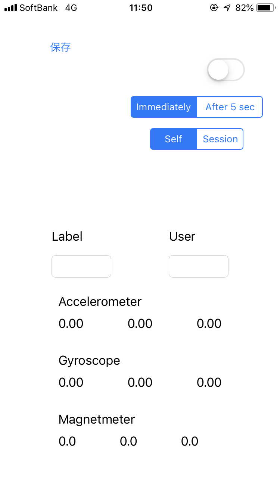
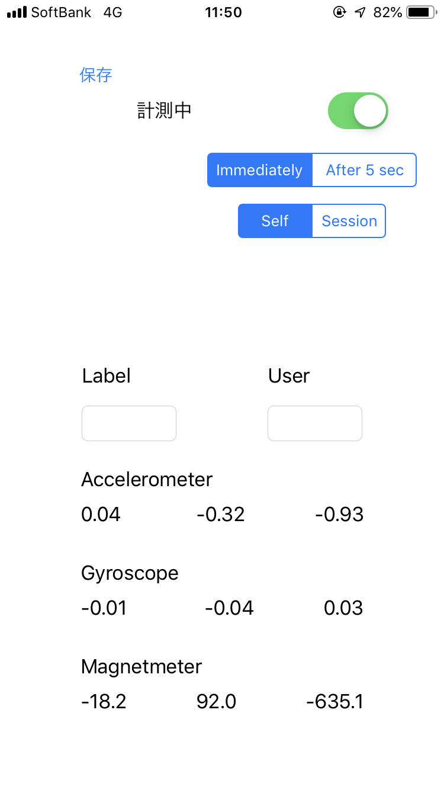
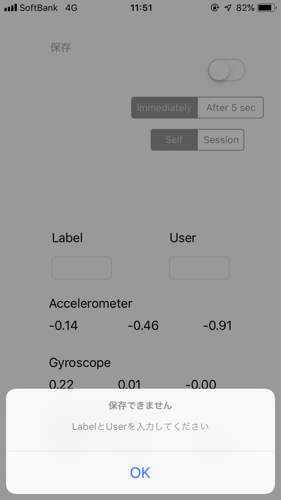

#  Logger

This application can measure acceleraton data, gyroscope data and magnetic data, and save them in CSV file.

||
:-:|:-:|:-:

## Version

4.1.0

- Note: New app with SwiftUI and Combine is [this](https://github.com/Shakshi3104/Logger5).

## Requirements
- iOS 10.3+
- Xcode 10.2.1+

## Update History

| Version | Update Date | Contents |
|:--------:|:---------------:|:-----------|
| 1.0.0 | 2019/5/15 | Measure accelerometer values |
| 1.1.0 | 2019/5/16 | Background task |
| 2.0.0 | 2019/5/16 | Collect acceleration data, gyroscope data and magnetic data |
| 2.1.0 | 2019/5/17 | Add |mmediately / After 5 sec mode |
| 2.2.0 | 2019/5/23 | Change implementation to use Timer() |
| 3.0.0 | 2019/5/30 | Add Session / Self mode |
| 3.1.0 | 2019/5/30 | Add a notification after Session ends |
| 3.1.1 | 2019/6/2 | Layout doesn't collapse on anything other then 4.7-inch iPhone |
| 4.0.0 | 2019/6/6 | Need to input Label and User to save file |
| 4.0.1 | 2019/6/6 | Change default mode to Self |
| 4.0.2 | 2019/6/7 | Fix a bug that changed the mode from Self to Session |
| 4.1.0 | 2019/6/9 | Support for iPod touch |
| [5.0.0](https://github.com/Shakshi3104/Logger5) | 2020/5/4 | Redesign with SwiftUI and Combine |
